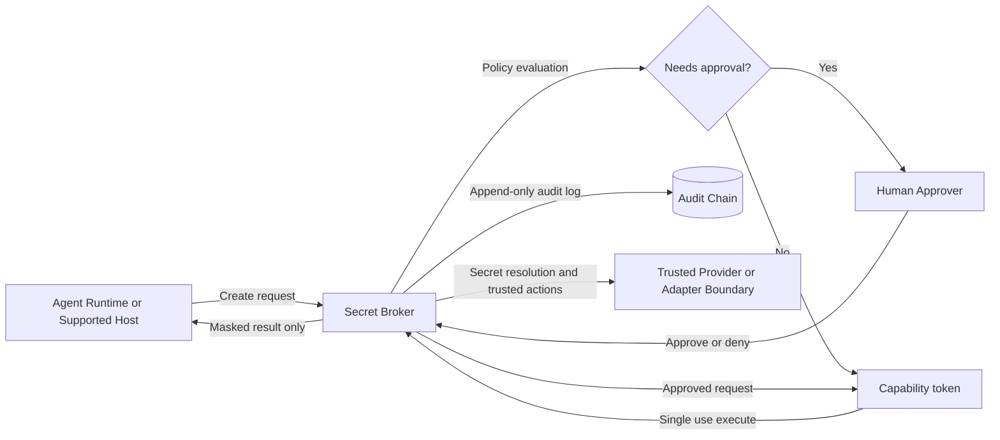

# AgentSecrets

Self-hosted, open-source secret broker for agent workflows.

## About

AgentSecrets is a Rust service that sits between an agent runtime and any action that depends on sensitive credentials. The broker is designed so agents can ask for secret-dependent work without the broker API returning plaintext secret values.

This repo is for teams that want a narrow, inspectable trust boundary instead of handing long-lived secrets directly to Claude, Codex, OpenClaw, or other agent runtimes.

## Why This Exists

Most agent stacks still pass secrets through prompts, transcripts, tool outputs, or loosely-scoped environment variables. That makes review harder and leak paths wider.

AgentSecrets narrows that model:

- Agent runtimes are treated as untrusted.
- Secrets stay behind the broker boundary.
- Requests can require human approval.
- Execution is bound to a one-time capability token.
- Broker responses stay masked instead of returning plaintext secret material.

## How It Works

1. A host or agent creates a secret-dependent request.
2. The broker validates policy and risk.
3. A human approver can approve or deny high-risk actions.
4. Approval mints a short-lived, single-use capability token.
5. The agent executes the approved action through the broker.
6. The broker returns masked results and appends audit evidence.



## Current Status

The project already provides broker-level no-plaintext-response guarantees and a broker-owned trusted-input session path for supported hosts.

It does **not** yet claim a universal, end-to-end transcript-safe zero-trust system for arbitrary external host applications. If you need exact shipping boundaries, read these first:

- [Security guarantees](docs/product/SECURITY_GUARANTEES.md)
- [Redaction policy](docs/product/REDACTION_POLICY.md)
- [Supported hosts](docs/product/SUPPORTED_HOSTS.md)
- [Platform support](docs/product/PLATFORM_SUPPORT.md)

Read [docs/product/SUPPORTED_HOSTS.md](docs/product/SUPPORTED_HOSTS.md) for the current V3 host-certification boundary.
Use [docs/product/SUPPORTED_HOSTS.md](docs/product/SUPPORTED_HOSTS.md) as the only V3 host-certification source of truth.

## What Ships Today

- Role-separated API keys for `client` and `approver`
- Modes: `off`, `monitor`, `enforce`
- Single-use capability tokens with TTL
- Replay protection
- Approval-time binding of request id, action, and target
- Policy checks for target allowlists and amount caps
- Automatic expiry of stale requests
- Masked-only execution responses
- Append-only audit log with hash-chain tamper evidence
- Request-level rate limiting
- Trusted-input sessions that mint one-time opaque refs
- Registry-backed trusted execution adapter paths for supported actions
- Audit-chain verification and redact-safe forensic bundle export
- Cross-platform service paths for Linux, macOS, and Windows

## Security Model

- Agent runtimes are untrusted.
- Broker API responses do not return plaintext secret values.
- `secret_ref` must be opaque, such as `bw://vault/item/login` or a broker-issued `tir://session/<id>` ref.
- Plaintext secret values are rejected at request creation.
- Rejected ingress attempts are audited without echoing submitted secret content.
- Trusted-input sessions are bounded, expire, and can only be consumed once into a matching request context.
- Approval responses include masked review payloads.
- Capability tokens are one-time and invalid after execution.
- External host-app transcript safety is only claimed inside the documented support matrix.

## Quickstart

For a full operator guide, use [docs/product/QUICKSTART.md](docs/product/QUICKSTART.md). Minimal local setup:

1. Copy `.env.example` to `.env`.
2. Set strong values for:
   - `SECRET_BROKER_CLIENT_API_KEY`
   - `SECRET_BROKER_APPROVER_API_KEY`
3. Set `SECRET_BROKER_MODE=enforce`.
4. Start the broker:

```bash
cargo run
```

Default bind address: `127.0.0.1:4815`

Health check:

```bash
scripts/healthcheck.sh http://127.0.0.1:4815
```

Container path:

```bash
docker build -t secret-broker .
docker run --rm -p 4815:4815 --env-file .env secret-broker
```

## API Overview

- `GET /healthz`
- `GET /readyz`
- `POST /v1/trusted-input/sessions`
- `GET /v1/trusted-input/sessions/:id`
- `POST /v1/trusted-input/sessions/:id/complete`
- `POST /v1/requests`
- `GET /v1/requests`
- `POST /v1/requests/:id/approve`
- `POST /v1/requests/:id/deny`
- `POST /v1/execute`
- `GET /v1/audit`
- `POST /v1/admin/keys/:role/rotate`

Auth headers:

- `Authorization: Bearer <key>`
- `x-api-key: <key>`

## Configuration

Required for a real deployment:

- `SECRET_BROKER_MODE=enforce`
- `SECRET_BROKER_CLIENT_API_KEY=...`
- `SECRET_BROKER_APPROVER_API_KEY=...`

Common controls:

- `SECRET_BROKER_ALLOWED_TARGET_PREFIXES`
- `SECRET_BROKER_MAX_AMOUNT_CENTS`
- `SECRET_BROKER_CAPABILITY_TTL_SECONDS`
- `SECRET_BROKER_REQUEST_TTL_SECONDS`
- `SECRET_BROKER_RATE_LIMIT_PER_MINUTE`

Trusted-input and host identity controls:

- `SECRET_BROKER_PROVIDER_BRIDGE_MODE=off|stub`
- `SECRET_BROKER_EXECUTION_ADAPTER_MODE=off|stub|request-sign-production`
- `SECRET_BROKER_IDENTITY_VERIFICATION_MODE=off|stub|host-signed|hardware-backed`
- `SECRET_BROKER_IDENTITY_ATTESTATION_KEY`
- `SECRET_BROKER_IDENTITY_HOST_SIGNING_KEYS=<host>=<key>,...`
- `SECRET_BROKER_TRUSTED_HOST_RUNTIME_PAIRS=<host>=<runtime>|<runtime>,...`

Recommended documented OpenClaw host deployment:

- `SECRET_BROKER_IDENTITY_VERIFICATION_MODE=host-signed`
- `SECRET_BROKER_IDENTITY_HOST_SIGNING_KEYS=openclaw-http-host=<strong random key>`
- `SECRET_BROKER_TRUSTED_HOST_RUNTIME_PAIRS=openclaw-http-host=openclaw-runtime-v1`

Notes:

- `enforce` mode refuses default dev keys and requires distinct client and approver keys.
- Env keys seed the `api_keys` table on first run.
- Rotated keys take effect immediately without restart.
- `hardware-backed` identity mode is not implemented yet.
- Host-signed envelope replay rejection is currently process-local, not durable across restart or failover.

See `.env.example` for the full variable set.

## Run And Test

Run the service:

```bash
cargo run
```

Run tests:

```bash
cargo test
```

Static checks:

```bash
cargo fmt --all -- --check
cargo clippy --all-targets --all-features -- -D warnings
```

E2E harness:

```bash
bash scripts/run-e2e-harness.sh
```

Forensics:

```bash
cargo run --bin forensics -- verify-chain --db sqlite://secret-broker.db?mode=rwc
```

## Code Layout

- [src/lib.rs](src/lib.rs): config, DB init, router wiring, runtime entrypoint
- [src/adapter.rs](src/adapter.rs): trusted execution adapter contract and stub runtime
- [src/handlers/health.rs](src/handlers/health.rs): liveness and readiness endpoints
- [src/handlers/requests.rs](src/handlers/requests.rs): request lifecycle and audit listing
- [src/handlers/trusted_input.rs](src/handlers/trusted_input.rs): trusted-input session lifecycle and opaque ref issuance
- [src/handlers/execution.rs](src/handlers/execution.rs): capability-guarded execution path
- [src/auth.rs](src/auth.rs): API key auth and rate limiting
- [src/keys.rs](src/keys.rs): DB-backed API key seeding and rotation
- [src/policy.rs](src/policy.rs): validation and policy decisions
- [src/audit.rs](src/audit.rs): append-only hash-chain audit logging
- [migrations/](migrations): schema history

## Docs Map

- [Docs index](docs/INDEX.md)
- [Quickstart](docs/product/QUICKSTART.md)
- [Integration notes](docs/product/INTEGRATION.md)
- [Threat model](docs/architecture/THREAT_MODEL.md)
- [Operations runbook](docs/operations/OPERATIONS.md)
- [Troubleshooting](docs/operations/TROUBLESHOOTING.md)
- [Roadmap](ROADMAP.md)
- [Release gates and claim authority](docs/product/RELEASE.md)

## Contributing

Start with [CONTRIBUTING.md](CONTRIBUTING.md). For security-sensitive findings, use [SECURITY.md](SECURITY.md).

If you change public behavior, update the README and the docs alongside the code.

## License

This project is licensed under [AGPL-3.0-or-later](LICENSE).
