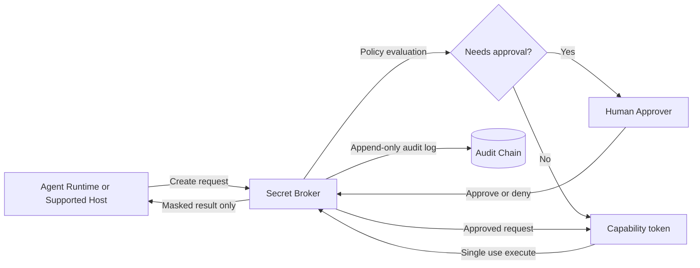

# AgentSecrets

Self-hosted, open-source secret broker for agent workflows.

## About

AgentSecrets is a Rust service that sits between an agent runtime and any action that depends on sensitive credentials. The goal is simple: let agents request secret-dependent work without the broker API returning plaintext secret values.

This repo is for teams that want a narrow, inspectable trust boundary instead of handing long-lived secrets directly to Claude, Codex, OpenClaw, or similar runtimes.

## Why It Exists

Most agent stacks still push secrets through prompts, transcripts, tool output, or loose environment variables. AgentSecrets narrows that model:

- agent runtimes are treated as untrusted
- secrets stay behind the broker boundary
- risky actions can require human approval
- execution is bound to a one-time capability token
- broker responses stay masked

## Flow



## Current Scope

Today this repo provides broker-level masked-response guarantees and a broker-owned trusted-input path for supported hosts.

It does **not** yet claim a universal end-to-end transcript-safe system for arbitrary external host apps.

Exact boundaries live in:

- [Security guarantees](docs/product/SECURITY_GUARANTEES.md)
- [Supported hosts](docs/product/SUPPORTED_HOSTS.md)
- [Platform support](docs/product/PLATFORM_SUPPORT.md)
- [Threat model](docs/architecture/THREAT_MODEL.md)

## Quick Start

Minimal local setup:

```bash
cp .env.example .env
cargo run
```

Run tests:

```bash
cargo test
```

For real deployment steps, service setup, and safety guidance, use [Quickstart](docs/product/QUICKSTART.md).

## Docs

- [Docs index](docs/INDEX.md)
- [Quickstart](docs/product/QUICKSTART.md)
- [Integration guide](docs/product/INTEGRATION.md)
- [Operations runbook](docs/operations/OPERATIONS.md)
- [Troubleshooting](docs/operations/TROUBLESHOOTING.md)
- [Roadmap](ROADMAP.md)

## Contributing

Start with [CONTRIBUTING.md](CONTRIBUTING.md). For security-sensitive reports, use [SECURITY.md](SECURITY.md).

## License

[AGPL-3.0-or-later](LICENSE)
